# AWS Batch Module - Comprehensive Documentation

## 📋 Table of Contents

- [Overview](#overview)
- [Architecture](#architecture)
- [Components](#components)
- [Configuration](#configuration)
- [Prerequisites](#prerequisites)
- [Deployment](#deployment)
- [Environment Variables](#environment-variables)
- [Cost Optimization](#cost-optimization)
- [Monitoring and Logging](#monitoring-and-logging)
- [Troubleshooting](#troubleshooting)
- [Security](#security)
- [Scaling](#scaling)
- [Integration](#integration)
- [Performance Comparison](#performance-comparison)
- [Best Practices](#best-practices)
- [Support](#support)

## 🎯 Overview

The AWS Batch module provides infrastructure for **hybrid batch processing**, where:
- **Lambda** processes small chunks (≤290K records) - fast startup, low cost
- **AWS Batch** processes large chunks (>290K records) - high memory, no timeout

This approach optimizes cost and performance by using the most appropriate compute resource for each workload size.

### Key Benefits

✅ **Cost Optimization**: 70% cost savings with spot instances  
✅ **Performance**: No timeout issues for large datasets  
✅ **Scalability**: Auto-scaling from 0 to 256 vCPUs  
✅ **Flexibility**: JSON-based configuration  
✅ **Security**: Private subnets, encrypted storage  

## 🏗️ Architecture

```mermaid
graph TB
    A[Step Function] --> B{Chunk Size}
    B -->|≤290K| C[AWS Lambda]
    B -->|>290K| D[AWS Batch]
    
    C --> E[Fast Processing]
    D --> F[Heavy Processing]
    
    E --> G[Kafka/SQS]
    F --> G
    
    subgraph "AWS Batch Components"
        H[Compute Environment]
        I[Job Queue]
        J[Job Definitions]
        K[Launch Template]
        L[CloudWatch Logs]
    end
    
    D --> H
    H --> I
    I --> J
    J --> K
    K --> L
```



## 🔧 Components

### Compute Environment
- **Type**: MANAGED (AWS manages infrastructure)
- **Instance Types**: c5.4xlarge, c5.2xlarge, c5.xlarge
- **Capacity**: 0-256 vCPUs (auto-scaling)
- **Spot Instances**: 100% bid percentage for cost optimization
- **Subnets**: Private subnets for security

### Job Queue
- **State**: ENABLED for active processing
- **Priority**: 1 (highest priority)
- **Compute Environment**: Links to batch compute environment
- **Job Scheduling**: FIFO with priority-based ordering

### Job Definitions

#### Validation Job
- **Purpose**: Validates entire files before processing
- **Resources**: 4 vCPUs, 8GB memory
- **Timeout**: 2 hours
- **Retries**: 3 attempts
- **Script**: `batch_validator.py`

#### Processing Job
- **Purpose**: Processes individual chunks
- **Resources**: 4 vCPUs, 8GB memory
- **Timeout**: 2 hours
- **Retries**: 3 attempts
- **Script**: `batch_processor.py`
- **Environment Variables**:
  - `KAFKA_BROKERS`
  - `KAFKA_TOPIC`
  - `SQS_CORE_QUEUE`
  - `RECORD_DESTINATION`

### Launch Template
- **AMI**: Amazon Linux 2 ECS-Optimized
- **Instance Type**: c5.4xlarge
- **Storage**: 100GB GP3 encrypted volume
- **Monitoring**: Enhanced monitoring enabled
- **Security Groups**: Batch-specific security group

### CloudWatch Log Groups
- **Validation Logs**: `/aws/batch/{prefix}-batch-validation`
- **Processing Logs**: `/aws/batch/{prefix}-batch-processing`
- **Retention**: 30 days

## ⚙️ Configuration

The module uses JSON files for configuration, following the same pattern as the Lambda module:

```
modules/
├── batch.hcl                    # Main Terragrunt configuration
├── batch-json/                  # JSON configuration files
│   ├── compute-environment.json # Compute environment configuration
│   ├── job-queue.json          # Job queue configuration
│   ├── batch-validation-job.json # Validation job definition
│   ├── batch-processing-job.json # Processing job definition
│   ├── launch-template.json    # EC2 launch template
│   └── log-groups.json         # CloudWatch log groups
├── batch_user_data.sh          # EC2 user data script
└── README-batch.md             # Documentation
```

### JSON Configuration Examples

#### Compute Environment
```json
{
  "name": "${PREFIX}-batch-compute",
  "type": "MANAGED",
  "compute_resources": {
    "type": "EC2",
    "max_vcpus": 256,
    "min_vcpus": 0,
    "desired_vcpus": 64,
    "instance_types": [
      "c5.4xlarge",
      "c5.2xlarge",
      "c5.xlarge"
    ],
    "subnets": ${SUBNETS},
    "security_group_ids": [
      "${SCM_BATCH_PROCESSOR_BATCH_SG}"
    ],
    "bid_percentage": 100
  }
}
```

#### Job Definition
```json
{
  "name": "${PREFIX}-batch-processing-job",
  "type": "container",
  "container_properties": {
    "image": "public.ecr.aws/lambda/python:3.9",
    "vcpus": 4,
    "memory": 8192,
    "command": [
      "/opt/batch-processing/batch_processor.py",
      "--chunk-id", "Ref::chunkId",
      "--start-index", "Ref::startIndex",
      "--end-index", "Ref::endIndex"
    ],
    "environment": [
      {
        "name": "KAFKA_BROKERS",
        "value": "${MSK_BROKERS}"
      },
      {
        "name": "RECORD_DESTINATION",
        "value": "${RECORD_DESTINATION}"
      }
    ]
  }
}
```

### Customizing JSON Files

You can customize any of these JSON files to match your specific requirements:

#### Example: Modifying Instance Types
```json
// compute-environment.json
{
  "compute_resources": {
    "instance_types": [
      "c5.8xlarge",  // Larger instances for more memory
      "c5.4xlarge",
      "c5.2xlarge"
    ]
  }
}
```

#### Example: Changing Resource Allocation
```json
// batch-processing-job.json
{
  "container_properties": {
    "vcpus": 8,      // More vCPUs
    "memory": 16384  // 16GB memory
  }
}
```

#### Example: Adding Environment Variables
```json
// batch-processing-job.json
{
  "container_properties": {
    "environment": [
      {
        "name": "CUSTOM_VAR",
        "value": "custom_value"
      }
    ]
  }
}
```

## 📋 Prerequisites

### IAM Roles
Create the following IAM roles in your `iam-roles` module:

```hcl
# Service role for AWS Batch
scm-batch-processor-batch-role = {
  # AWSBatchServiceRole policy
  # S3, CloudWatch, ECS permissions
}

# Instance profile for EC2 instances
scm-batch-processor-batch-instance-role = {
  # S3, CloudWatch, MSK, SQS permissions
}
```

### Security Groups
Create a security group for batch processing:

```hcl
scm-batch-processor-batch = {
  # Outbound rules for S3, CloudWatch, MSK, SQS
  # No inbound access required
}
```

### Modules Configuration
Add the batch module to your `modules.hcl`:

```hcl
# In modules.hcl
module_urls = {
  batch_ext = "git::https://github.com/your-org/terraform-aws-batch.git"
}

# In version.hcl
module_versions = {
  batch_ext = "v1.0.0"
}
```

## 🚀 Deployment

### 1. Deploy the Module
```bash
cd terraform/step-function/real-code/modules
terragrunt plan
terragrunt apply
```

### 2. Update Step Function
The Step Function will automatically use AWS Batch for chunks >290K records:

```hcl
# In your step-function.hcl
dependency "batch" {
  config_path = "../batch"
}

# The Step Function will reference:
# - aws_batch_job_queue.batch_processing_queue.arn
# - aws_batch_job_definition.batch_processing_job.arn
# - aws_batch_job_definition.batch_validation_job.arn
```

### 3. Monitor Jobs
```bash
# View job queue
aws batch describe-job-queues --job-queues gss-dev-batch-queue

# View compute environment
aws batch describe-compute-environments --compute-environments gss-dev-batch-compute

# View job status
aws batch describe-jobs --jobs job-12345678-1234-1234-1234-123456789012
```

## 🔧 Environment Variables

### Required Environment Variables
- `AWS_REGION`: AWS region
- `S3_BUCKET`: S3 bucket for data storage
- `KAFKA_BROKERS`: MSK broker endpoints
- `KAFKA_TOPIC`: Kafka topic name
- `SQS_CORE_QUEUE`: SQS queue URL
- `RECORD_DESTINATION`: "kafka" or "sqs_core"

### Optional Environment Variables
- `BATCH_PROCESSING_THRESHOLD`: Record threshold for Batch vs Lambda (default: 290000)

## 💰 Cost Optimization

### Spot Instances
- Uses 100% spot instances for cost savings
- Automatic fallback to on-demand if needed
- ~70% cost reduction compared to on-demand

### Instance Sizing
- c5.4xlarge: High CPU, cost-effective for processing
- Auto-scaling: Scales down to 0 when not in use
- Pay only for what you use

### Storage
- GP3 volumes: Better performance, lower cost
- 100GB default: Adjust based on your data size
- Encrypted at rest for security

## 📊 Monitoring and Logging

### CloudWatch Logs
- **Validation Logs**: `/aws/batch/{prefix}-batch-validation`
- **Processing Logs**: `/aws/batch/{prefix}-batch-processing`
- **Retention**: 30 days

### Metrics
- Job success/failure rates
- Processing time per chunk
- Resource utilization
- Cost metrics

### CloudWatch Alarms
```bash
# Create alarm for job failures
aws cloudwatch put-metric-alarm \
  --alarm-name "batch-job-failures" \
  --alarm-description "Alarm when batch jobs fail" \
  --metric-name "FailedJobs" \
  --namespace "AWS/Batch" \
  --statistic "Sum" \
  --period 300 \
  --threshold 1 \
  --comparison-operator "GreaterThanThreshold"
```

## 🔍 Troubleshooting

### Common Issues

#### Job Stuck in RUNNABLE
```bash
# Check compute environment status
aws batch describe-compute-environments --compute-environments gss-dev-batch-compute

# Check for capacity issues
aws batch describe-job-queues --job-queues gss-dev-batch-queue
```

#### Job Failing
```bash
# Check job logs
aws logs describe-log-streams --log-group-name "/aws/batch/gss-dev-batch-processing"

# Get job details
aws batch describe-jobs --jobs job-12345678-1234-1234-1234-123456789012
```

#### Permission Issues
```bash
# Verify IAM roles
aws iam get-role --role-name gss-dev-scm-batch-processor-batch-role
aws iam get-instance-profile --instance-profile-name gss-dev-scm-batch-processor-batch-instance-role
```

### Debug Commands
```bash
# List all batch resources
aws batch describe-job-definitions
aws batch describe-job-queues
aws batch describe-compute-environments

# Monitor job progress
aws batch list-jobs --job-queue gss-dev-batch-queue --job-status RUNNING
```

### Common Error Messages

| Error | Cause | Solution |
|-------|-------|----------|
| `INSUFFICIENT_INSTANCE_CAPACITY` | No available instances | Increase desired vCPUs or use different instance types |
| `JOB_QUEUE_DISABLED` | Queue is disabled | Enable the job queue |
| `COMPUTE_ENVIRONMENT_DISABLED` | Compute environment is disabled | Enable the compute environment |
| `INVALID_JOB_DEFINITION` | Job definition is invalid | Check job definition parameters |

## 🔒 Security

### Network Security
- Instances run in private subnets
- Security group restricts outbound traffic
- No inbound access required

### Data Security
- EBS volumes encrypted at rest
- S3 access via IAM roles
- MSK authentication via IAM

### IAM Security
- Least privilege principle
- Separate roles for service and instances
- No long-term credentials

### Security Best Practices
```bash
# Enable VPC Flow Logs
aws ec2 create-flow-logs \
  --resource-type VPC \
  --resource-ids vpc-12345678 \
  --traffic-type ALL \
  --log-destination-type cloud-watch-logs \
  --log-group-name "vpc-flow-logs"

# Enable CloudTrail
aws cloudtrail create-trail \
  --name "batch-audit-trail" \
  --s3-bucket-name "my-audit-bucket"
```

## 📈 Scaling

### Automatic Scaling
- Scales from 0 to 256 vCPUs based on demand
- Spot instances for cost optimization
- Automatic instance termination when idle

### Manual Scaling
```bash
# Update compute environment
aws batch update-compute-environment \
  --compute-environment gss-dev-batch-compute \
  --compute-resources desiredVcpus=128
```

### Scaling Policies
```json
{
  "scaling_policies": [
    {
      "name": "scale-up",
      "target_tracking_scaling_policy_configuration": {
        "target_value": 70.0,
        "scale_in_cooldown": 300,
        "scale_out_cooldown": 60
      }
    }
  ]
}
```

## 🔗 Integration

### Integration with Step Function

The Step Function automatically routes chunks based on size:

```json
{
  "ProcessChunk": {
    "Type": "Choice",
    "Choices": [
      {
        "Variable": "$.chunkSize",
        "NumericGreaterThan": 290000,
        "Next": "SubmitBatchJob"
      }
    ],
    "Default": "ProcessWithLambda"
  }
}
```

This ensures optimal resource usage and cost efficiency.

### Integration with Other Services

#### S3 Integration
```json
{
  "container_properties": {
    "environment": [
      {
        "name": "S3_BUCKET",
        "value": "Ref::bucket"
      }
    ]
  }
}
```

#### MSK Integration
```json
{
  "container_properties": {
    "environment": [
      {
        "name": "KAFKA_BROKERS",
        "value": "${MSK_BROKERS}"
      },
      {
        "name": "KAFKA_TOPIC",
        "value": "${MSK_TOPIC}"
      }
    ]
  }
}
```

## 📊 Performance Comparison

| Metric | Lambda | AWS Batch |
|--------|--------|-----------|
| Startup Time | ~100-500ms | ~2-5 minutes |
| Cost (60M records) | ~$15 | ~$26.40 |
| Memory Limit | 15GB | Unlimited |
| Timeout | 15 minutes | Unlimited |
| Scalability | Automatic | Manual configuration |
| Error Isolation | Per function | Per job |
| Cold Start | Yes | Yes (but longer) |

### Performance Optimization Tips

1. **Chunk Sizing**: Use 290K records as the threshold
2. **Instance Types**: Choose based on memory requirements
3. **Spot Instances**: Use for cost optimization
4. **Parallel Processing**: Increase concurrent jobs
5. **Resource Allocation**: Monitor and adjust vCPUs/memory

## 🎯 Best Practices

### Chunk Sizing
- Use 290K records as the threshold
- Larger chunks reduce overhead
- Smaller chunks provide better error isolation

### Resource Allocation
- Start with 4 vCPUs, 8GB memory
- Monitor and adjust based on performance
- Use spot instances for cost optimization

### Monitoring
- Set up CloudWatch alarms for job failures
- Monitor resource utilization
- Track cost metrics

### Error Handling
- Implement retry logic in job definitions
- Use exponential backoff
- Log detailed error information

### Security
- Use private subnets
- Encrypt data at rest and in transit
- Follow least privilege principle

### Cost Optimization
- Use spot instances
- Scale down when not in use
- Monitor and optimize resource allocation

## 🆘 Support

### Getting Help

For issues or questions:

1. **Check CloudWatch logs** for detailed error messages
2. **Review IAM permissions** and security group rules
3. **Verify network connectivity** to S3, MSK, and SQS
4. **Check compute environment capacity** and scaling

### Useful Commands

```bash
# Check job status
aws batch describe-jobs --jobs job-12345678-1234-1234-1234-123456789012

# View compute environment
aws batch describe-compute-environments --compute-environments gss-dev-batch-compute

# Check job queue
aws batch describe-job-queues --job-queues gss-dev-batch-queue

# List recent jobs
aws batch list-jobs --job-queue gss-dev-batch-queue --job-status RUNNING

# Get job logs
aws logs describe-log-streams --log-group-name "/aws/batch/gss-dev-batch-processing"
```

### Common Issues and Solutions

| Issue | Symptoms | Solution |
|-------|----------|----------|
| Jobs stuck in RUNNABLE | Jobs not starting | Check compute environment capacity |
| High costs | Unexpected charges | Review spot instance usage |
| Job failures | Jobs failing repeatedly | Check logs and IAM permissions |
| Slow processing | Long job times | Optimize resource allocation |

### Contact Information

- **Team**: DevOps/Infrastructure
- **Slack**: #batch-processing-support
- **Email**: batch-support@company.com
- **Documentation**: [Internal Wiki](https://wiki.company.com/batch-processing)

## 📚 Related Documentation

- [Lambda Module Documentation](./README-lambda.md)
- [Step Function Module Documentation](./README-step-function.md)
- [AWS Batch Best Practices](https://docs.aws.amazon.com/batch/latest/userguide/best-practices.html)
- [Cost Optimization Guide](https://docs.aws.amazon.com/batch/latest/userguide/cost-optimization.html)
- [Troubleshooting Guide](https://docs.aws.amazon.com/batch/latest/userguide/troubleshooting.html)

---

**Last Updated**: January 2024  
**Version**: 1.0.0  
**Maintainer**: DevOps Team 